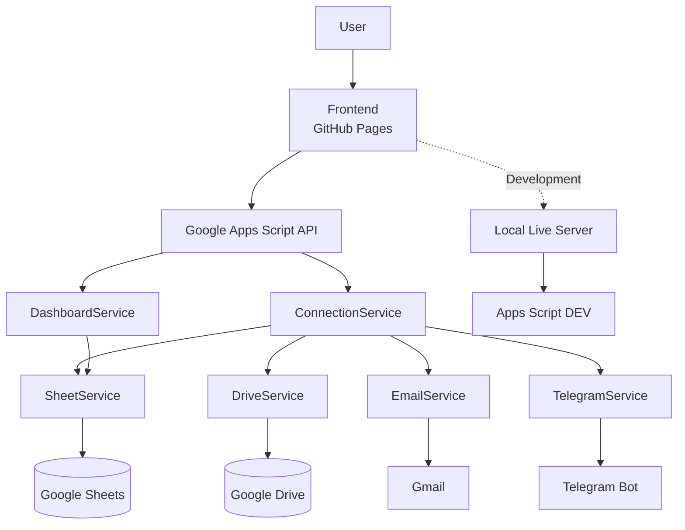

# Private Connections

> A private long-distance communication platform built to create meaningful digital memories.


---

# Overview

Private Connections is a personal web application designed to strengthen long-distance relationships by allowing private messages and media sharing through a lightweight cloud backend.

The project evolved from a simple MVP into a modular application with independent Development and Production environments, documented architecture and automated deployment.

---

# Features

- ❤️ Private messages
- 📷 Image upload
- 🎥 Video upload
- 🎵 Audio upload
- ☁ Google Drive storage
- 📊 Google Sheets database
- 📨 Email notifications
- 📱 Telegram notifications
- 📚 Personal memory timeline
- 🌎 Independent Development and Production environments

---

# Architecture

```
Frontend
│
├── HTML
├── CSS
├── JavaScript (ES Modules)
│
▼
Google Apps Script API
│
├── Connection Service
├── Dashboard Service
├── Drive Service
├── Email Service
├── Telegram Service
├── Sheet Service
│
▼
Google Workspace
│
├── Google Drive
├── Google Sheets
├── Gmail
└── Telegram Bot
```

---

# Project Structure

```
private-connections/

backend/
└── apps-script/

frontend/
├── assets/
├── css/
├── js/
└── index.html

docs/
```

---

# Environments

The project maintains two completely independent environments.

## Development

- Local Live Server
- Development Apps Script
- Development Google Drive
- Development Spreadsheet

## Production

- GitHub Pages
- Production Apps Script
- Production Google Drive
- Production Spreadsheet

---

# Technologies

Frontend

- HTML5
- CSS3
- JavaScript ES Modules

Backend

- Google Apps Script

Cloud Services

- Google Drive API
- Google Sheets
- Gmail
- Telegram Bot API

Infrastructure

- Git
- GitHub
- GitHub Actions
- GitHub Pages

---

# Version History

| Version | Description |
|----------|-------------|
| v0.1.0 | Initial MVP |
| v0.2.0 | First production release |
| v1.0.0 | Modular architecture, independent environments, documentation and automated deployment |

---

# Documentation

Project documentation is available in `/docs`.

- Architecture
- Deployment
- Roadmap
- Changelog
- Privacy

---

# Development Workflow



# License

MIT License

---

## Author

**Alexandre Tolentino**

Software Engineering • Cloud • DevOps • Infrastructure • Full Stack Development

> *Building software one improvement at a time.*