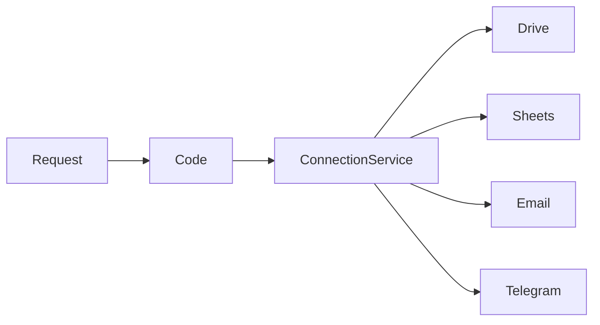

# Backend

This folder contains the Google Apps Script backend.

## Responsibilities

- Receive frontend requests
- Save attachments
- Store connections
- Send email notifications
- Send Telegram notifications
- Return dashboard statistics

---

## Modules

```text
Code.gs
Config.gs
ConnectionService.gs
DriveService.gs
SheetService.gs
EmailService.gs
TelegramService.gs
Utils.gs
```

---

## Flow

