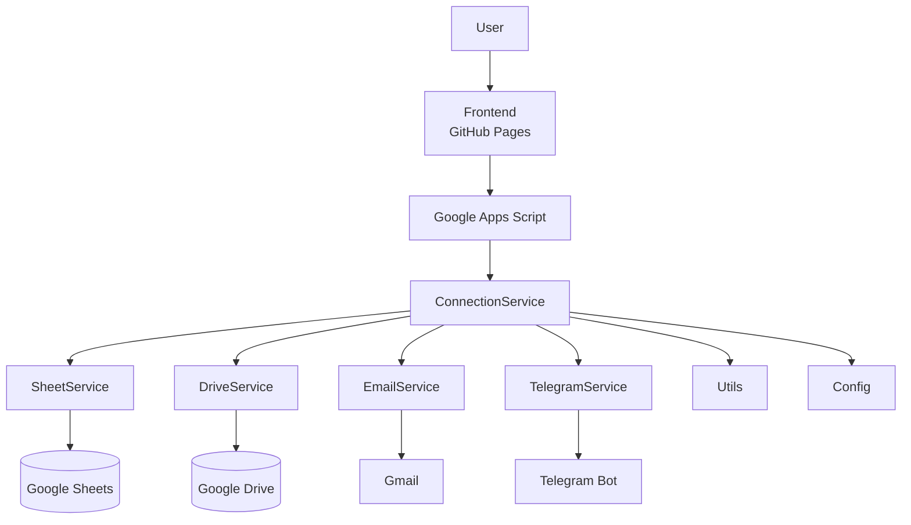
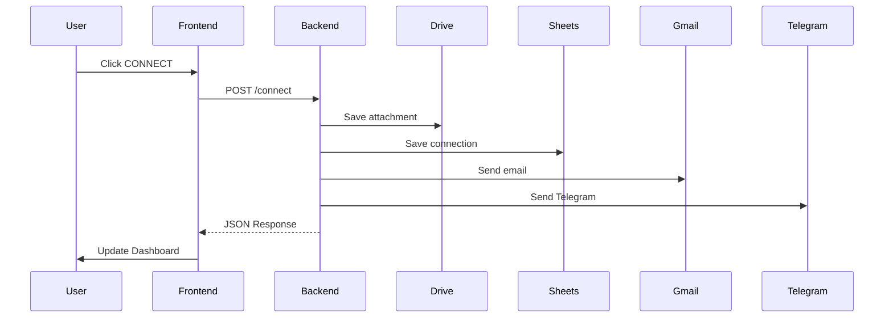

# Private Connections Architecture

Version: 0.3.0

---

## Overview

Private Connections is composed of two independent layers:

- Frontend (GitHub Pages)
- Backend (Google Apps Script)

The frontend is responsible for the user experience.

The backend manages storage, notifications and analytics.

---

## High Level Architecture



---

## Request Flow



---

## Backend Modules

| Module | Responsibility |
|---------|----------------|
| Code | HTTP Entry Point |
| Config | Environment Configuration |
| ConnectionService | Business Logic |
| SheetService | Google Sheets |
| DriveService | Google Drive |
| EmailService | Gmail |
| TelegramService | Telegram Bot |
| Utils | Shared Functions |

---

## Frontend Modules

| Module | Responsibility |
|---------|----------------|
| app.js | Application Controller |
| api.js | Backend Communication |
| ui.js | Screen Rendering |
| upload.js | File Processing |
| tracking.js | Analytics |
| utils.js | Helper Functions |
| config.js | Frontend Configuration |

---

## Environments

### Development

- Live Server
- Development Backend
- Development Database

### Production

- GitHub Pages
- Production Backend
- Production Database

---

## Current Version

Current Architecture

```
Frontend
      │
      ▼
Google Apps Script
      │
      ▼
ConnectionService
├── Drive
├── Sheet
├── Email
├── Telegram
└── Utils
```